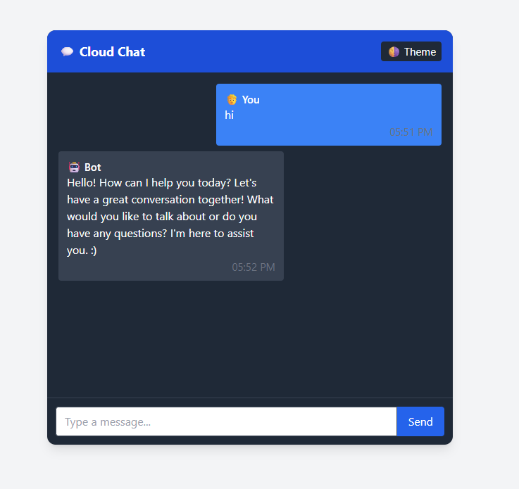

# 🌐 Cloud Chat App with AI Bot 🤖

A real-time chat application built with **WebSockets**, a **Node.js backend**, and a **local AI-powered chatbot** powered by **Ollama**. This project enables instant messaging between users and a smart assistant that runs completely offline using models like **Mistral** or **LLaMA3**.

---

## 🚀 Features

- 📡 **Real-time Chat** — Seamless communication using WebSockets.
- 🤖 **Local AI Bot** — Responses powered by local LLMs (via Ollama), no internet or API keys needed.
- 💬 **Minimal UI** — Clean and responsive front-end built with HTML & JavaScript.
- 🔒 **Private & Secure** — Entirely local; no external API calls.
- ⚡ **Lightweight** — No database or heavy dependencies required.

---

## 🏗️ Project Structure

```
cloud-chat-app/
├── backend/
│   └── server.js        # Node.js WebSocket server with AI integration
├── frontend/
│   └── client.html      # Minimal chat UI
└── README.md            # Project documentation
```

---

## 🧠 Technologies Used

| Area       | Tools & Libraries               |
|------------|----------------------------------|
| Frontend   | HTML, JavaScript, WebSocket API |
| Backend    | Node.js, WebSocket (`ws`), Axios |
| AI Bot     | Ollama + Local LLMs (`mistral`, `llama3`) |

---

## 📦 How It Works

1. **User opens** the `client.html` in a browser.
2. **WebSocket connects** to the Node.js server at `ws://localhost:5050`.
3. **User sends a message**, which is forwarded to the AI bot.
4. **AI response** is generated using a local LLM through Ollama.
5. **Reply is sent back** via WebSocket and displayed on the UI.

---

## 🛠️ Setup Instructions

### 1. Install Node.js and Ollama

- [Node.js Download](https://nodejs.org/)
- [Ollama Install](https://ollama.com/download)

### 2. Clone This Repository

```bash
git clone https://github.com/your-username/cloud-chat-app.git
cd cloud-chat-app
```

### 3. Install Dependencies

```bash
cd backend
npm install
```

### 4. Run the Backend Server

```bash
ollama run mistral        # or ollama run llama3
npm start
```

Ensure Ollama is serving on `http://localhost:11434`.

### 5. Open the Frontend

Open `frontend/client.html` in any modern browser.

---

## 🧪 Example Models Supported

- `mistral` (recommended for low memory)
- `llama3` (better quality, needs more RAM)

> 🧠 You can switch models by changing the `model` field in `server.js`.

---

## 💡 Future Improvements

- [ ] Typing indicator & chat history
- [ ] Emoji support & avatars
- [ ] Dark mode toggle 🌙
- [ ] Multi-user chat rooms
- [ ] Docker container for deployment

---

## 📷 Preview

 *(optional)*

---

## 📝 License

This project is licensed under the MIT License — feel free to use and modify it!

---

## 🙋‍♂️ Contributing

Pull requests are welcome! For major changes, open an issue first to discuss what you’d like to change.
